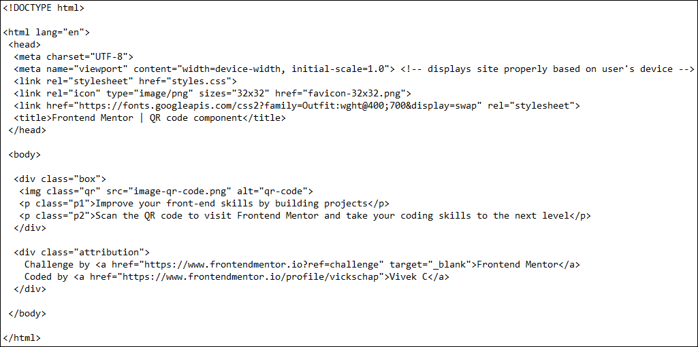
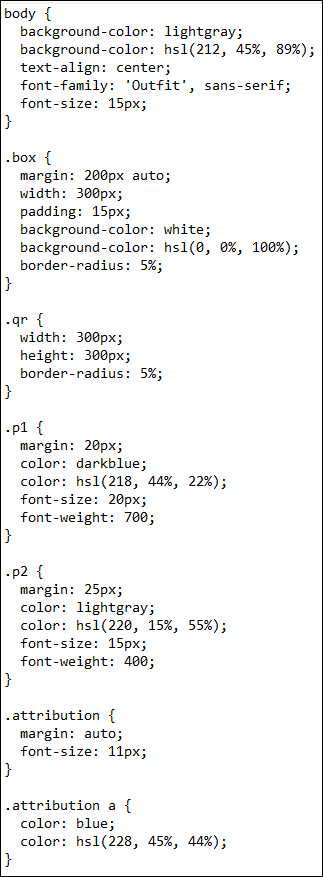

# Frontend Mentor - QR code component solution

This is a solution to the [QR code component challenge on Frontend Mentor](https://www.frontendmentor.io/challenges/qr-code-component-iux_sIO_H). Frontend Mentor challenges help you improve your coding skills by building realistic projects. 

## Table of contents

- [Overview](#overview)
- [Project Requirement](#project-requirement)
- [Code Snapshots](#code-snapshots)
- [Solution Link](#solution-link)
- [Useful resources](#useful-resources)
- [Author](#author)
- [Acknowledgments](#acknowledgments)

## Overview

A very basic project involving some HTML and CSS code suitable for entry-level coders. It is a good starting project to test your basic HTML & CSS knowledge.

## Project Requirement

To create a QR code design as below using the provided images, HTML code structure and style-guide.

## Codes Snapshots
 - *HTML :*  

 - *CSS :*  

## Solution Link

- Solution URL: [My solution URL](https://www.frontendmentor.io/solutions/qr-code-component-challenge-solution-using-html-and-css-PtZSSA73YM)

## Useful resources

- [Markdownguide.org](https://www.markdownguide.org) - This helped me for writing this markdown.
- [W3Schools](https://www.w3schools.com) - A go-to-site for all our basic coding lessons and useful tips.

## Author

- Frontend Mentor - [@vickschap](https://www.frontendmentor.io/profile/vickschap)

## Acknowledgments

I would like to thank [Frontend Mentor](https://www.frontendmentor.io) for providing a platform to budding coders & developers to practice their skills on various real life challenges and gain new knowledge by interacting with other coders and mentors.
